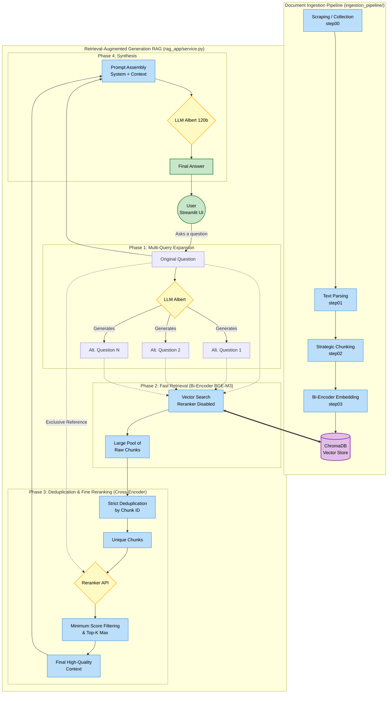

# ESG RAG Studio


Production-ready local RAG workspace for ESG reports:

- PDF ingestion pipeline (parse -> chunk -> index)
- Streamlit chat UI with grounded evidence
- Multi-collection retrieval with reranking controls
- Score-threshold filtering to remove weak chunks
- Highlighted source evidence rendered directly in PDFs

## What This Project Does

This project lets you index ESG documents into ChromaDB and ask grounded questions.
The app shows both generated answers and the exact retrieved evidence chunks.

Main use cases:

- ESG report exploration and Q&A
- Traceable answer generation with source chunks
- Prompt and retrieval parameter experimentation
- Lightweight automatic evaluation with ROUGE metrics

## Architecture & Pipeline



## Core RAG Flow

At query time, the app executes the following robust pipeline:

1. **Multi-Query Retrieval (MQR)**: Generate diverse semantic variations of the original question.
2. **Fast Bi-Encoder Retrieval**: Retrieve a large pool of Top K chunks for _all_ query variations (Reranker is disabled here for speed and recall).
3. **Deduplication**: Keep only unique chunks based on their ID.
4. **Cross-Encoder Reranking**: Re-evaluate the entire deduped pool strictly against the _original question_.
5. **Score Filtering**: Drop chunks below the minimum rerank score.
6. **Final Generation**: Generate the answer from the filtered, high-quality context chunks.
7. **Traceability UI**: Render the answer alongside evidence chunks and optional highlighted PDF pages.

## Quick Start

### 1) Prerequisites

- Python >= 3.12
- `uv` installed
- Albert API key

### 2) Install dependencies

```bash
uv sync
```

### 3) Configure environment

Create a `.env` file at project root:

```bash
ALBERT_API_KEY=your_api_key
```

Optional variables are listed in the Configuration section.

### 4) Run ingestion (local PDF folder)

```bash
uv run python -m ingestion_pipeline.main
```

This indexes PDFs from `downloads/` into local ChromaDB.

### 5) Launch Streamlit

```bash
uv run streamlit run streamlit_app.py
```

## Streamlit UI Overview

### Core Config

- API key (runtime override)
- LLM model selection from API-discovered models
- Chroma collection multi-select

### Upload PDF

From the sidebar:

1. Select a PDF
2. Click Ingest & index uploaded PDF
3. Ask questions immediately against the new collection

The upload flow stores the PDF in a dedicated collection and tracks page metadata for evidence highlighting.

### Advanced Controls

The following controls are available under Advanced controls:

- Embedding model (read-only)
- Enable reranker (On/Off)
- Reranker model (read-only)
- Top K (per collection retrieval)
- Final Top K (final chunk count after filtering)
- Reranker candidate pool (max candidates sent to reranker)
- Min rerank score (chunks below this score are discarded)
- System prompt

Default values used by Reset settings:

- `Top K = 3`
- `Final Top K = 8`
- `Reranker candidate pool = 24`
- `Min rerank score = 0.25`
- `System prompt = DEFAULT_SYSTEM_PROMPT`
- `Reranker backend/model = config defaults`
- `Embedding model = config default`

Two utility actions are available:

- Reset settings: resets all Advanced controls to defaults
- Reset prompt: resets only the system prompt

## Evidence & Traceability

For each assistant response, you can inspect:

- Evidence chunks (text, score, distance, metadata)
- PDF evidence (highlighted pages when source PDF is available)

Notes:

- Highlight quality depends on extractable text quality
- Scanned/OCR-poor PDFs may reduce highlight precision
- For historical indexed collections, source PDFs should exist locally (for example in `downloads/`)

## Configuration

Configured in `config.py` and environment variables.

```bash
ALBERT_API_KEY=...
EMBEDDING_MODEL=BAAI/bge-m3
RERANK_BACKEND=api            # api | none
RERANK_MODEL=BAAI/bge-reranker-v2-m3

CHUNKING_STRATEGY=token_overlap   # token_overlap | sentence_overlap
MIN_CHUNK_TOKENS=300
MAX_CHUNK_TOKENS=500
CHUNK_OVERLAP_TOKENS=50
SENTENCE_CHUNK_SIZE=8
SENTENCE_CHUNK_OVERLAP=2
```

## Evaluation

### ROUGE Metrics

Run automatic basic evaluation using ROUGE (token overlap):

```bash
uv run evaluate_rag.py --dataset evaluation/qa_dataset.example.json --output evaluation/last_eval_report.json
```

### LLM-as-a-judge

For a deeper semantic evaluation assessing correctness, relevance, and groundedness of the generation:

```bash
uv run evaluate_rag_llmaaj.py --dataset evaluation/qa_dataset.example.json --output evaluation/last_eval_report_llm.json
```

Evaluation reports include:

- Per-sample scores (ROUGE / LLM judgments)
- Aggregated averages
- Retrieved chunk metadata

Tip: prefer the one-line command above to avoid shell line-break issues.

## Project Structure

```text
.
├── config.py
├── evaluate_rag.py
├── evaluate_rag_llmaaj.py
├── pyproject.toml
├── streamlit_app.py
├── ingestion_pipeline/
│   ├── main.py
│   ├── step00_scraping.py
│   ├── step01_parsing.py
│   ├── step02_chunking.py
│   └── step03_indexing.py
├── rag_app/
│   ├── albert_client.py
│   ├── prompts.py
│   ├── retriever.py
│   ├── service.py
│   └── types.py
├── streamlit_ui/
│   └── ui.py
├── evaluation/
│   ├── qa_dataset.example.json
│   ├── last_eval_report.json
│   └── last_eval_report_llm.json
└── chroma_db/
```

## Troubleshooting

### `ALBERT_API_KEY is required`

Set `ALBERT_API_KEY` in `.env` or in the Streamlit sidebar.

### `zsh: command not found: --dataset`

Use the evaluation command on one line:

```bash
uv run evaluate_rag.py --dataset evaluation/qa_dataset.example.json --output evaluation/last_eval_report.json
```

### No collections found in UI

Run ingestion first:

```bash
uv run python -m ingestion_pipeline.main
```

### Too many irrelevant chunks

Increase `Min rerank score` in Advanced controls and/or reduce `Final Top K`.
